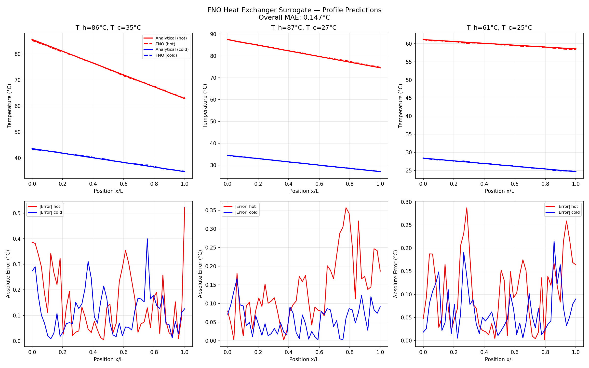
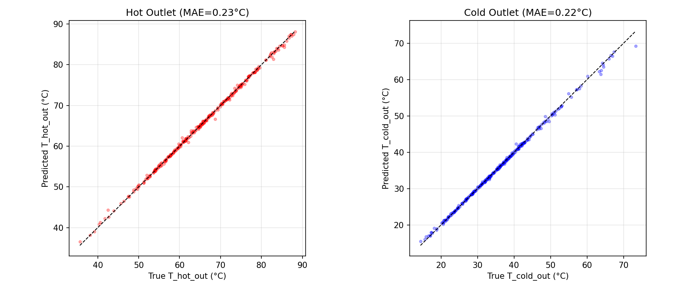

# Heat Exchanger Neural Surrogate (FNO)

Fourier Neural Operator trained to predict temperature profiles in a shell-and-tube heat exchanger. Replaces the traditional ε-NTU analytical calculation with 7x faster inference and sub-0.15°C accuracy.

## Results

| Metric | Value |
|--------|-------|
| Profile MAE (hot side) | 0.152°C |
| Profile MAE (cold side) | 0.142°C |
| Outlet temperature MAE | 0.23°C |
| Inference speedup (batch of 32) | **7x** faster than analytical |
| Model parameters | 283,650 |


*FNO predictions (dashed) vs analytical ε-NTU solution (solid) across three operating conditions*



## Approach

1. **Training data generation** — 2,000 heat exchanger scenarios using ε-NTU method with CoolProp temperature-dependent water properties. Varies: inlet temperatures, flow rates, tube length, tube count, fouling factor.
2. **FNO architecture** — Input lifting → 4 Fourier layers (16 modes, learned weights in frequency domain) → Output projection. Maps 7 operating parameters to 2×50 spatial temperature profiles (hot + cold sides).
3. **Training** — Adam optimizer with cosine annealing, 200 epochs, MSE loss on normalized profiles.

### Why FNO?

Standard neural networks predict scalar outputs. The FNO learns **function-to-function mappings** — predicting the entire spatial temperature profile T(x) at once. The Fourier layers operate in frequency space, making them resolution-invariant: a model trained on 50 spatial points can evaluate at any resolution.

## Data

No external data needed — all training data is generated from first-principles thermodynamics:
- **Shell-and-tube counterflow** configuration
- **CoolProp** for temperature-dependent fluid properties (water)
- **Dittus-Boelter** correlations for forced convection heat transfer
- Input ranges: T_hot 60-95°C, T_cold 10-35°C, flow rates 0.5-5.0 kg/s

## Project Structure

```
src/
  physics/hx_model.py     # ε-NTU solver, CoolProp integration, data generator
  models/fno.py            # Fourier Neural Operator (SpectralConv1d, FourierLayer, FNO1d)
train.py                   # End-to-end training pipeline
outputs/
  figures/                 # Profile comparisons, scatter plots, speed benchmark
  models/                  # Trained FNO checkpoint, results JSON
```

## Quick Start

```bash
pip install -r requirements.txt
python train.py
```

## Tech Stack

- **PyTorch** — FNO implementation (lightweight, no PhysicsNeMo dependency)
- **CoolProp** — temperature-dependent fluid properties
- **ε-NTU method** — counterflow heat exchanger analytical model

## Part of the Physical AI Portfolio

This is Project 1 of a 7-project portfolio proving physics-informed AI skills across thermal systems, energy, structural mechanics, HVAC, pipe networks, rotating machinery, and CFD.
